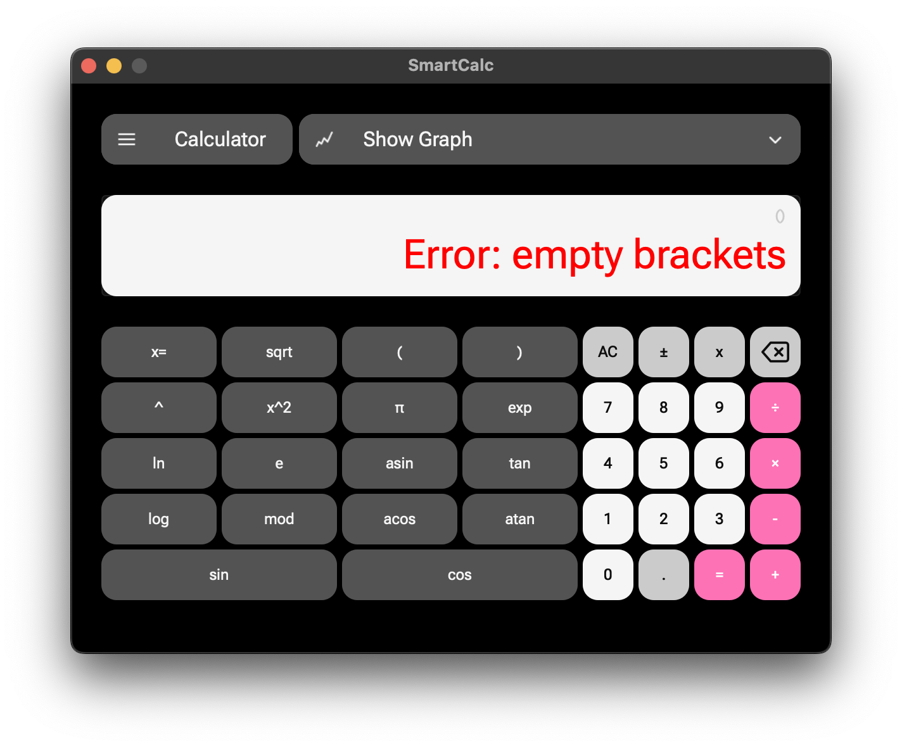
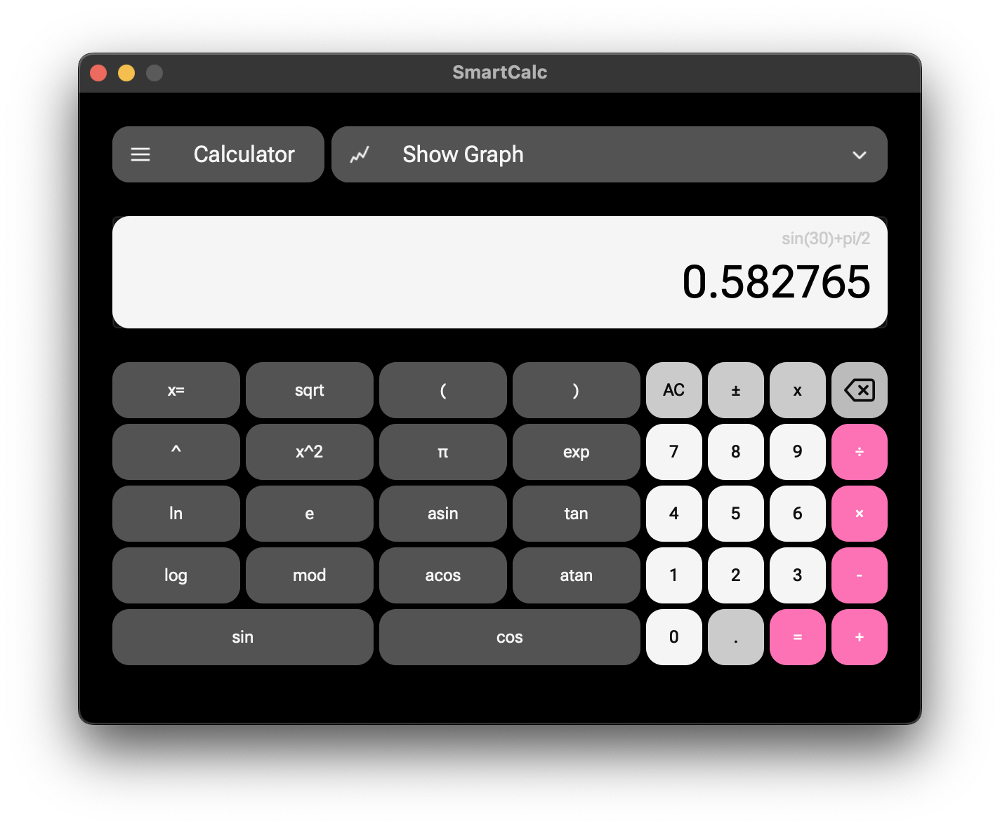
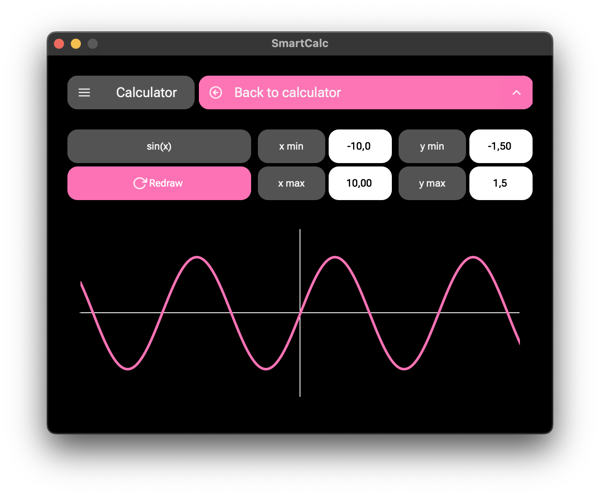
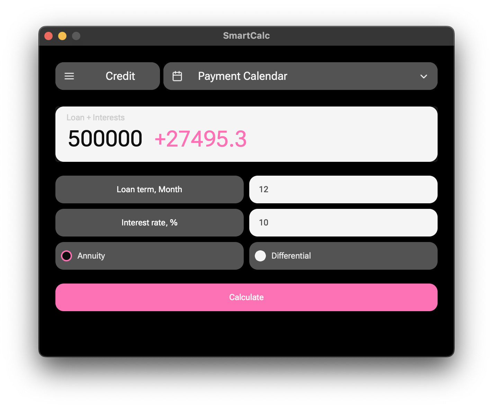
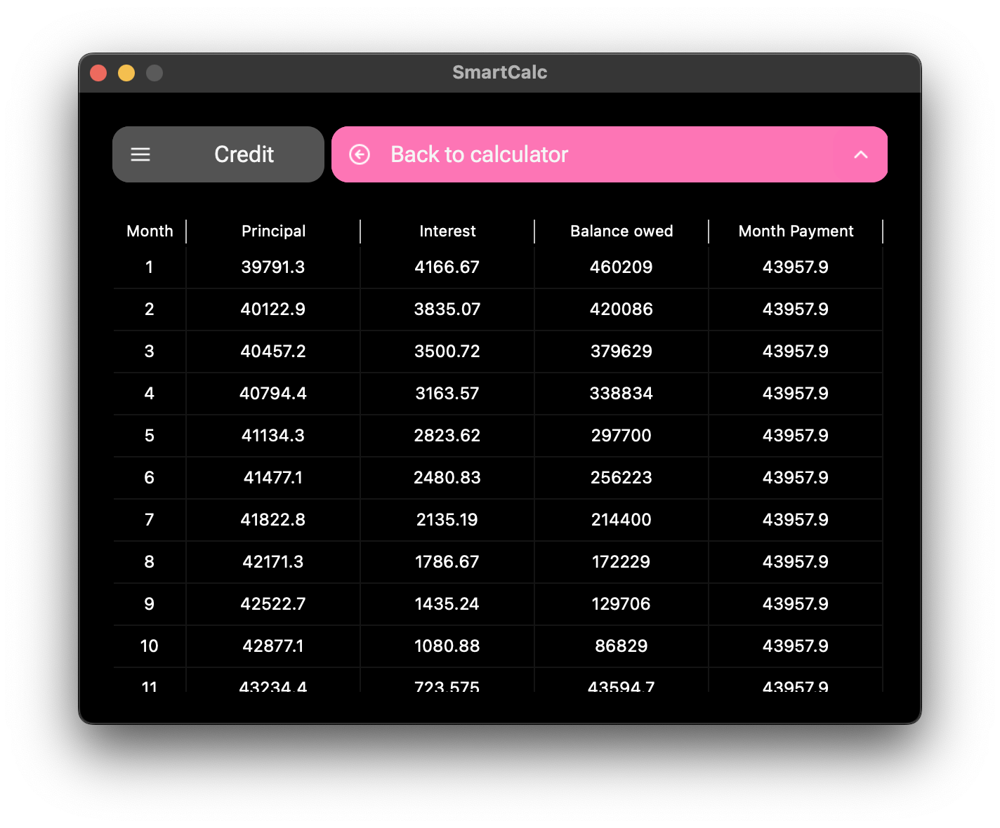

## Общие сведения
Программа SmartCalc является калькулятором с 3 режимами работы:<br>
    1. Калькулятор выражений;<br>
    2. Построение графиков;<br>
    3. Кредитный калькулятор;<br>

Визуальная часть выполнена в программе QT Creator (версия 11.0.3 Based on Qt 6.4.3 (Clang 13.0 (Apple), arm64)).<br>
Сборка осуществляется с помощью cmake.<br>
Построение графиков реализуется посредством библиотеки qcustomplot.<br>

## Описание программы
### Страница Calculator


<p align="center">Рис. 1. Страница Calculator: ввод выражения</p>

Параметры:<br>
- На вход программы могут подаваться как целые числа, так и вещественные числа, записанные и через точку, и в экспоненциальной форме записи;
- Вычисление производится после полного ввода вычисляемого выражения и нажатия на символ `=`;
- Поддерживается вычисление произвольных скобочных арифметических выражений в инфиксной нотации;
- Поддерживается вычисление произвольных скобочных арифметических выражений в инфиксной нотации с подстановкой значения переменной _x_ в виде числа;
- Поддерживается возможность ввода до 255 символов;
- Скобочные арифметические выражения в инфиксной нотации поддерживают следующие арифметические операции и математические функции:
    - **Арифметические операторы**: 
        | Описание оператора | Оператор |   
        | ---------------- | ------- |  
        | Скобки | (a + b)  |   
        | Сложение | + |  
        | Вычитание | - |  
        | Умножение | * | 
        | Деление | / | 
        | Возведение в степень | ^ |
        | Остаток от деления | mod |
        | Унарный плюс | +a | 
        | Унарный минус | -a |

    - **Функции**:
        | Описание функции | Функция |   
        | ---------------- | ------- |  
        | Вычисляет косинус | cos(x) |   
        | Вычисляет синус | sin(x) |  
        | Вычисляет тангенс | tan(x) |  
        | Вычисляет арккосинус | acos(x) | 
        | Вычисляет арксинус | asin(x) | 
        | Вычисляет арктангенс | atan(x) |
        | Вычисляет квадратный корень | sqrt(x) |
        | Вычисляет натуральный логарифм | ln(x) | 
        | Вычисляет десятичный логарифм | log(x) |


**Примечания:** <br>
- Кнопка унарного минуса "±" умножает значение "x" на -1.<br>
- Кнопка "⌫" удаляет только один последний символ из активной строки ввода выражения или значения "x".<br>

При невозможности программы к вычислениям предусмотрен вывод ошибки в строке вывода.<br>



<p align="center">Рис. 2. Страница Calculator: пример вывода ошибки</p>

Виды ошибок:<br>
1. Пустые скобки: "Error: empty brackets";<br>
2. Неравенство скобок: "Error: unbalanced brackets";<br>
3. Переполнение строки ввода (более 255 символов): "Error: input overflow";<br>
4. Множественные точки в десятичном числе: "Error: multiple decimals in a number";<br>
5. Неизвестный оператор: "Error: unknown operator";<br>
6. Пропущенный операнд: "Error: missed operand";<br>
7. Некорректное применение x: "Error: wrong x usage".<br>

При валидной строке ввода, после нажатия на кнопку "=", пользователь получает результат вычислений.<br>



<p align="center">Рис. 3. Страница Calculator: пример вывода результата вычислений при валидном выражении</p>

### Страница Graph


<p align="center">Рис. 4. Страница Graph: пример построения графика</p>

Параметры:<br>
  1. Построение графика функции, заданной с помощью выражения в инфиксной нотации с переменной _x_;
  2. Область определения и область значения функций ограничены числами от -1000000 до 1000000;

**Примечания:** <br>
График первоначально имеет параметры:<br>
Xmin = -10.00;<br>
Xmax = 10.00;<br>
Ymin = -10.00;<br>
Ymax = 10.00.<br>
Чтобы задать нужные параметры, можно с клавиатуры выставить желаемые значения и нажать на кнопку "redraw".<br>

На данной странице в строке выражения помимо ошибок со страницы Calculator предусмотрена еще одна, возникающая при логическом несоответствии параметров min и max у X или Y: "Error".<br>

### Страница Credit


<p align="center">Рис. 5. Страница Credit: пример расчета кредита</p>

Параметры:<br>
 - Вход: общая сумма кредита, срок, процентная ставка, тип (аннуитетный, дифференцированный);
 - Выход: общая выплата, выполненная в виде "общая сумма кредита + выплаченные проценты";
 - Ежемесячный платеж и другие параметры указаны во вкладке "Payment Calendar";
 - Размер кредита должен быть положительным числом;
 - Срок кредита ограничен от 1 до 600 месяцев;
 - Кредитная ставка должна быть в диапазоне 0.01-100%.

Предусмотрена ошибка: "Error", если пользователь ввел невалидные значения (указаны в параметрах).<br>

### Страница Payment Calendar


<p align="center">Рис. 6. Страница Payment Calendar: пример графика платежей по кредиту</p>

## Установка и открытие
Установка и открытие выполняется командой:

```
make
```

или 

```
make all
```

## Установка
Установка выполняется командой:

```
make install
```

## Запуск
Запуск выполняется командой 

```
make open
```

## Удаление приложения
Удаление выполняется командой:

```
make uninstall
``` 

## Очистка от побочных файлов 
Очистка от побочных файлов выполняется командой:

```
make clean
```

## Документация
Открытие документации выполняется командой:
```
make dvi
```

## Тестирование
Для запуска тестов необходимо выполнить команду:

```
make test
``` 

## Стиль
Проверка стиля через:

```
make style
```

Форматирование через:

```
make format
```

## Покрытие
Для запуска необходимо выполнить команду:

```
make gcov_report
```

Она автоматически откроет index.html с покрытием.

## Архивирование проекта
Чтобы получить архив, выполняется команда:

```
make dist
```

Она автоматически откроет index.html с открытием.

## Утечки
Для проверки программы на утечки предусмотрена команда утилиты valgrind:

```
make valgrind
```
